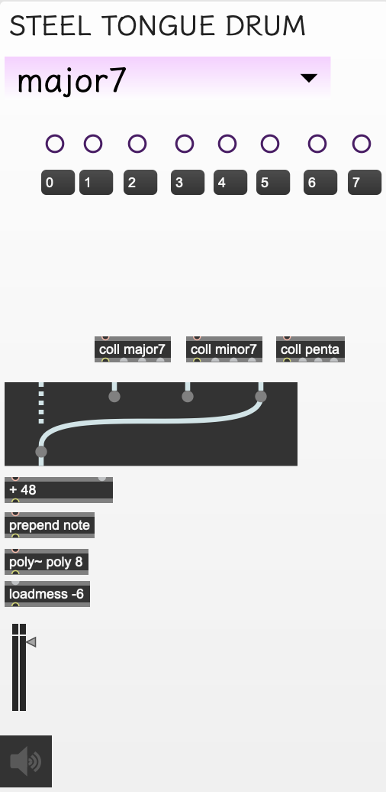

# [Digi Sound Healing App](https://drive.google.com/file/d/1tnAjzunsEWxkH3OcDAKgBSHk144ujLwu/view?usp=sharing)

	Synthetic sound healing instruments created by Zanne Hanna.
	
## Operator's Manual

	Manual Contents
	Section I: Introduction
	Section II: Gong
	Section III: Steel Tongue Drum
	Section IV: Tibetan Bowl
	Section V: Tuning Fork
	Section VI: Crystal Bowl
	Section VII: Research Question
	Section VIII: Acknowledgements
	Appendix A: Max Patches

## Section I: Introduction

### *Summary*

The Digi Sound Healing App is a virtual studio of synthetic sound healing instruments that can be played live and modified to the player's personal taste or health-focused goal. The parameters offered for these instruments are meant to encourage creativity in restorative yoga teaching, sequencing, and musical performances in the yoga studio. 

With this app, sound healing becomes more accessible for teachers, yogis, and any listeners searching for the mind-body connection that sound therapy offers. To ensure accessibility for everyone, this app is free to the public, and the following manual encourage's the interface's simple playability. Users can choose to play the instrument as is or manipulate the spectral information of these instruments in ways that benefit motivations of the yogic practice. 

The goal of sound healing is to connect the mind and the parts of body through resonant frequencies that result in one harmonic whole. This form of healing also follows principles of "entrainment" that state that two oscillating objects will begin to tune to each other as they move closer towards each other ([Heather](https://d1wqtxts1xzle7.cloudfront.net/31852105/ijhc_article.pdf?1378636344=&response-content-disposition=inline%3B+filename%3DWHAT_IS_SOUND_HEALING.pdf&Expires=1597283813&Signature=JAoS2wNwApJ1ieO0KkNIlrYAIivXLDYKEwrpG0NSeSNNVjCCv~n~xWH1E~y~CjI33KAhMvNEytj6~tDHF8oLM81YFuEos6AeNroQrA7gOvzNtVfvzWtvn0W0PtCeeW1nZm792QPT0l~razJu5q5pwyYfjeDEnRgDUMAsQSEXVl0wYWG6D7AqAdPb-RtncACWjXOvFRMcd5BtHFs233gfTf5wE4xLAiTa2Pi~Zvjca0uQ8v-KZdF8cKKT9kFHnNq~RwPVjRC8X~tApTseoalVlMc2n28BKhXr~YeSAs6bfXdNbWsQnBWFpKf0ABDh6NhMDQkkE-2OlF3KlEWkLmD7Cw__&Key-Pair-Id=APKAJLOHF5GGSLRBV4ZA)). Additionally, *Music Therapy Perspectives* defines **sound healing** as "the direct impact of physical, acoustical vibrations on bodily structures, physiolog­ ical functioning, and neural activity" ([Crowe](https://watermark.silverchair.com/14-1-21.pdf?token=AQECAHi208BE49Ooan9kkhW_Ercy7Dm3ZL_9Cf3qfKAc485ysgAAArIwggKuBgkqhkiG9w0BBwagggKfMIICmwIBADCCApQGCSqGSIb3DQEHATAeBglghkgBZQMEAS4wEQQM98oHaQP3bxi4qV-vAgEQgIICZToPzcOQpew8WrZ__zcetUe6QWsX6kmEsQWJlBPF6q5ERZRkvHamqfU3wfULhQ7sKS0fYjoTcMzs-3ppkxP3-uDLrkyPxun4Tch5QI2LP6l60ms6fQw4O3bOFvMpyaW6r5PYSz9WgtbS0nvJjwrIvt-B6vWH65OHZQk51M5NQy8oBcxO85YNURjaIS2qDReBa_yFbezMrd81NSguHPeknNV7UZu7FprHgfRjfMmbWxciTB2ZyZ5GeWJI0fdC7qVToKYwqI2I8kky5b0l6dKqTiPbVO51qqU6jm8Wj3neqR4ZRIGawo1AmBemvtX66VnxWzbGi5mB45rJeqaF2EP_WDmb-tLjI35vdEKbSkMSXTJ-HKg-mb9nGGxxyFiBenHkJNF7oFv4YL3hm3ah_GR-rlAfUqOUs2cRnQT2vz4aGKpwIDuVyALBNPaJC8QRYczVs2EIsRLmrR1Y9exXSwl3HvNwHDsDFG2H6Hhk6yIv3bkbcCIo7ws30wMxD16HUqQuC7CzZuAS2Jk-234HE0SsKhzsqHnvMSJACJRoEs2Wr3RirRTvZ4Ci3jmjL5l8IF8KNVEkDpV8CpOKTea9bT0WaNcjbon-QiXneTWsWTyQ4tjnrvaB6zOvlkltelTyVF19-XQuz2-Lir7TAUnj7QrlxuVg9kUXwyVFODtLhWSUFREuJtkb7Xc12JG3wLPf-pHP5IHE7gLUWE6PB4GppBii1qyG9Ik7B6dR66i8TOz5X8X5mPB1SRqyAxTHOcUOeR3lYOzvjGL68Lmp3CzkWl1Q2O22D7FMrnpNfznnfHNX5wGLmEqbRTg)). 
As sound healing emerges as a secondary facet of music therapy, I consider a research question that explores how sound healing instruments in the digital realm differ in effectiveness from physical sound healing instruments in the analog realm. 

### *Installation*

1. Download the app from [here](https://drive.google.com/file/d/1tnAjzunsEWxkH3OcDAKgBSHk144ujLwu/view?usp=sharing).
2. Drop the application from the zipped file in the Applications folder on your computer. 
3. Check that your preferred audio settings on your computer are correct.
4. Open the application.
5. Click the "X" in the top left corner to turn on audio, and begin playing with your instruments.

### *Files Included*

-	README.md
- 	digiSoundHealingApp.zip
-  sectionI.png - sectionVI.png
-  figurei.png - figurev.png

## Section II: Gong

### *Synthesis Summary*

To create this instrument, I analyzed some gong samples in iZotope RX6, using additive synthesis techniques to combine the prominent frequencies in the gong. I combined these nine frequencies with six  of the same frequencies that use amplitude modulation to enhance the brightness factor of the gong. I then included a resonant filter bank using the same nine frequencies and white noise to enhance the washiness factor of the gong. 

	See Appendix A-i for patch creation in Max.

### *Parameters*

- A) **Strike**: Click the center of the left-most gong to strike. Note that this will be the same velocity each time that you strike. Level adjustments will change the velocity of the strike. 
- B) **Gong shape**: There are three graphs that allow you to change the envelope of the gong's ring according to the length of ringing that you choose. Click along any point on the graph to change the envelope. Hold option while moving along a line between any two points to change the curve of that line, and shift click on any point to delete it. 
- C) **Length of gong**: Click on the small gong above the brown switch to choose between four, eight, and twelve seconds. If you choose a length of eight seconds, the gong will ring for eight seconds, following the corresponding envelope. 
- D) **Brightness level**: This fader will adjust the brighter harmonics of the gong. Move the small triangle next to the fader to make adjustments. Changes will affect the overall velocity of the gong.
- E) **Washiness level**: This fader will adjust the washing, noisy timbres of the gong. Move the small triangle next to the fader to make adjustments. Changes will affect the overall velocity of the gong.

## Section III: Steel Tongue Drum

### *Synthesis Summary*

To create this instrument, I watched recorded performances of the steel tongue drum at different sizes. I used a polyphonic object in conjunction with ring modulation to set each of the eight pitches and ensure that they can be played together. I programmed three presets of scales: the major seventh outlines a major 7th chord with additional extentions 9, #11, and b13, The minor seventh outlines a minor 7th chord with additional extentions b5, and the pentatonic outlines the major pentatonic scale. 

	See Appendix A-ii for patch creation in Max.

### *Parameters* 

- A) **Scale presets**: Click on the drop-down menu to choose between three "scale" presets: major seventh, minor seventh, and major pentatonic. 
- B) **Strike**: Click near or on the purple buttons to activate the different pitches in the drum. 
- C) **Level**: Move the small triangle next to the fader to adjust the level of the drum. Note that adjustments will affect all eight pitches in the drum, not pitches individually. 

## Section IV: Tibetan Bowl 

### *Synthesis Summary*

To create this instrument, I analyzed some samples of tibetan bowls of different sizes using iZotope RX6 and referenced my own experience of seeing my yoga teachers play these bowls. I used a dial to function as the striker, and used different delay elements to ensure that the bowl continues to play as the striker moves around the bowl. I chose three different frequencies for the three different sizes, and I used similar amplitude modulation techniques as seen in the previous instruments. I used a resonant filter to create the scraping sound that is activated with the playing of the bowl. 

	See Appendix A-iii for patch creation in Max.

### *Parameters* 

- A) **Play/Scrape**: Move the black dial around the bowl in a circular motion generate vibrations and scraping from the bowl. This dial can be moved in either direction.
- B) **Size of bowl**: Choose between three bowl sizes to change the pitch of the bowl and scraping resonance. Medium is the default size. 
- C) **Level**: Move the small triangle next to the fader to adjust the level of the bowl. Note that this will only affect the level of the pitches coming from the bowl, not the level of the scraping sounds. 
- D) **Scraping Amount**: Move the small triangle next to the fader to adjust the level of the scraping sound. Note that this will only affect the level of the scraping resonance, not the level of the pitches coming from the bowl. 

## Section V: Tuning Fork

### *Synthesis Summary*

To create this instrument, I analyzed samples of tuning forks in iZotope RX6 to evaluate the movement of the tremolo in the tuning fork and the present harmonics. I emphasized the first and third overtones in the tuning fork, and used ADSR envelopes to create an initial striking sound and to have both harmonics release accurately with how I heard them in the samples. An importnat aspect of using the tuning fork in a restorative yoga class is being able to move it slowly around the room so that its resonant fills the corners of the space. To achieve a sense of moving the tuning fork around the room, I used panning, light pitch shifting, and a lowpass filter to create a subtle Doppler effect. 

	See Appendix A-iv for patch creation in Max.

### *Parameters* 

- A) **Strike**: Click on the image of the tuning fork to strike. 
- B) **Room Position**: Slowly drag the small circlular point around the area of the room to create a subtle Doppler effect of moving the tuning fork. 
- C) **Level**: Move the small triangle next to the fader to adjust the level of the tuning fork. 

## Section VI: Crystal Bowl

### *Synthesis Summary*

To create this instrument, I analyzed some samples of crystal bowls of different sizes using iZotope RX6 and referenced my own experience of seeing my yoga teachers play their own bowls in class. Elements of this instrument are similar to the tibetan bowl; however, the singing from these bowls features pure tones rather than amplitude modulated ringing. The strike sounds do use amplitude modulatin and ADSR envelopes to shape the ringing resulting from the strikes. There is a scraping element that uses a resonant filter with pink noise, and the scraping sound and singing use tremolo in conjunction with ADSR envelopes to sing with each other and to release slowly when stopped.

		See Appendix A-v for patch creation in Max.

### *Parameters*

- A) **Singing initialize and level**: Click on any of the first five colored buttons to initiate singing of the bowl, which corresponds to its designated pitch. Move the small triangle next to the fader below the corresponding bowl to adjust the level of the singing. To stop a bowl, click on its colored button again, and it will release. 
- B) **Scrape initialize and level**: Click on the button designated "scrape" to initiate a subtle scraping sound of a bowl. Move the small triangle next to the fader below the corresponding bowl to adjust the level of the scraping sound. To stop the scraping, click on its button again, and it will release. 
- C) **Strike initialize and level**: Click on any of the last five colored buttons to initiate a striking of the bowl, which increases in pitch as you move further right. Move the small triangle next to the fader below the corresponding bowl to adjust the level of the strike. 

## Section VII: Research Question

### *Background*

### *Hypothesis*

### *Materials*

### *Procedure*

### *Predicted Results*

## Section VIII: Acknowledgements

### *Resources*
[An Overview of Sound Healing Practices](https://watermark.silverchair.com/14-1-21.pdf?token=AQECAHi208BE49Ooan9kkhW_Ercy7Dm3ZL_9Cf3qfKAc485ysgAAArIwggKuBgkqhkiG9w0BBwagggKfMIICmwIBADCCApQGCSqGSIb3DQEHATAeBglghkgBZQMEAS4wEQQM98oHaQP3bxi4qV-vAgEQgIICZToPzcOQpew8WrZ__zcetUe6QWsX6kmEsQWJlBPF6q5ERZRkvHamqfU3wfULhQ7sKS0fYjoTcMzs-3ppkxP3-uDLrkyPxun4Tch5QI2LP6l60ms6fQw4O3bOFvMpyaW6r5PYSz9WgtbS0nvJjwrIvt-B6vWH65OHZQk51M5NQy8oBcxO85YNURjaIS2qDReBa_yFbezMrd81NSguHPeknNV7UZu7FprHgfRjfMmbWxciTB2ZyZ5GeWJI0fdC7qVToKYwqI2I8kky5b0l6dKqTiPbVO51qqU6jm8Wj3neqR4ZRIGawo1AmBemvtX66VnxWzbGi5mB45rJeqaF2EP_WDmb-tLjI35vdEKbSkMSXTJ-HKg-mb9nGGxxyFiBenHkJNF7oFv4YL3hm3ah_GR-rlAfUqOUs2cRnQT2vz4aGKpwIDuVyALBNPaJC8QRYczVs2EIsRLmrR1Y9exXSwl3HvNwHDsDFG2H6Hhk6yIv3bkbcCIo7ws30wMxD16HUqQuC7CzZuAS2Jk-234HE0SsKhzsqHnvMSJACJRoEs2Wr3RirRTvZ4Ci3jmjL5l8IF8KNVEkDpV8CpOKTea9bT0WaNcjbon-QiXneTWsWTyQ4tjnrvaB6zOvlkltelTyVF19-XQuz2-Lir7TAUnj7QrlxuVg9kUXwyVFODtLhWSUFREuJtkb7Xc12JG3wLPf-pHP5IHE7gLUWE6PB4GppBii1qyG9Ik7B6dR66i8TOz5X8X5mPB1SRqyAxTHOcUOeR3lYOzvjGL68Lmp3CzkWl1Q2O22D7FMrnpNfznnfHNX5wGLmEqbRTg)

[What is Sound Healing?](https://d1wqtxts1xzle7.cloudfront.net/31852105/ijhc_article.pdf?1378636344=&response-content-disposition=inline%3B+filename%3DWHAT_IS_SOUND_HEALING.pdf&Expires=1597283813&Signature=JAoS2wNwApJ1ieO0KkNIlrYAIivXLDYKEwrpG0NSeSNNVjCCv~n~xWH1E~y~CjI33KAhMvNEytj6~tDHF8oLM81YFuEos6AeNroQrA7gOvzNtVfvzWtvn0W0PtCeeW1nZm792QPT0l~razJu5q5pwyYfjeDEnRgDUMAsQSEXVl0wYWG6D7AqAdPb-RtncACWjXOvFRMcd5BtHFs233gfTf5wE4xLAiTa2Pi~Zvjca0uQ8v-KZdF8cKKT9kFHnNq~RwPVjRC8X~tApTseoalVlMc2n28BKhXr~YeSAs6bfXdNbWsQnBWFpKf0ABDh6NhMDQkkE-2OlF3KlEWkLmD7Cw__&Key-Pair-Id=APKAJLOHF5GGSLRBV4ZA)

### *Acknowledgements*

Thank you **Matthew Davidson** for your guidance as my advisor and professor in Advanced Production Projects, Software Instrument Building, and Advanced Seminar. Thank you **Susan Rogers** for teaching me about psychoacoustics. Thank you **Akito Van Troyer** for teaching me Max/MSP and how to write a good README.md. Thank you **Emily Tevald, Tim Kelleher, Renee LeBlanc, and Caitlyn Visconte** for teaching me yoga. Thank you **Zac, Esme, and Talula** for your endless encouragement. 

##Appendix A: Max Patches

### *(A-i) Gong Patch*

Notable objects:

- "mc.reson~"
- "function~"
- "mc.sig~"

### *(A-ii) Steel Tongue Drum Patch* 

### *(A-iii) Tibetan Bowl Patch*

### *(A-iv) Tuning Fork Patch*

### *(A-v) Crystal Bowl Patch*

